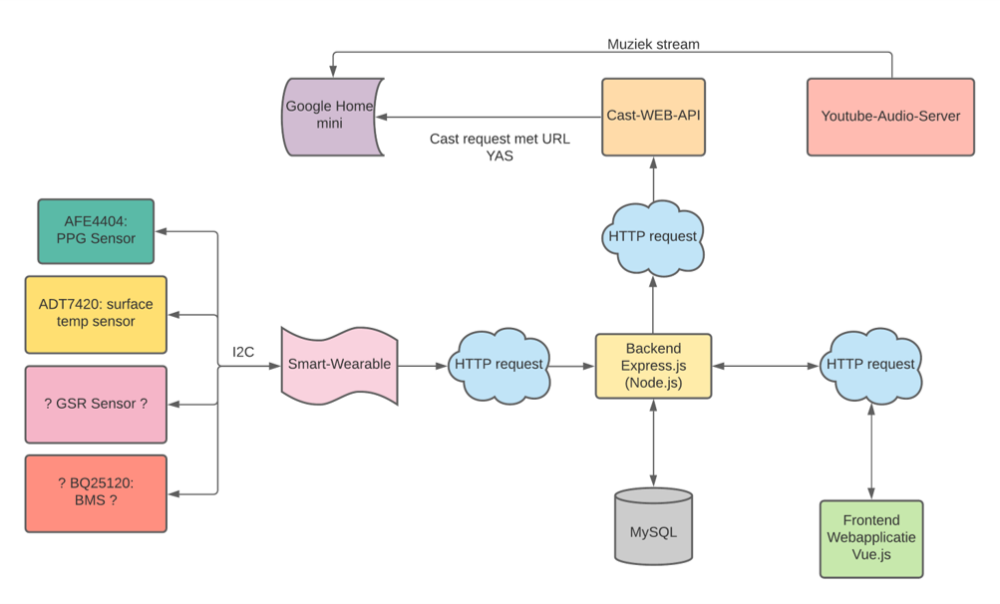

# Project heartbeats

## Installation

Each sub-project has its own instructions on how to install, all off which are shown in the README's
 
 ## Summary
 
For a school project we were tasked with figuring out a way to measure the stress levels for a patient with Alzheimer’s.
When we detect stress, we must start playback of a playlist defined by the users or admins. We chose to develop our own wearable to measure the heartrate to keep
down cost and spare us the time of cracking open API's, protocols etc. of know (open source or commercial) wearables.

The flow of measuring to playing music is shown in the following scheme:

 
 ## ESP32ProjectHeartbeat

This sub-project is our firmware for the ESP32 which controls the AFE4404 sensor, sends the measured data to the server on-site and which in future versions will probably have extra sensors like surface-temp, GSR and BMS.

 ## Project-Heartbeats

This sub-project's backend is our on-site server which interfaces with the API's and receives the data from the wearable. It also has a front-end powered by vuetify with its accompanying modules, with this front-end we can perform database manipulations like adding playlists, music, patients etc.

 ## modifiedyas

This sub-project provides the MP3 stream that the google-cast enabled device will play. this is based on downloading YouTube music, converting it to mp3 and then providing a stream-based page that you can refer to.

 ## modified_cast-web-api

This sub-project is used as an interface between the google-cast enabled device and the back-end server. We use it to point the device to the right mp3 link based on the data it gets from the back end. It can also be used to check the device's status.

 

